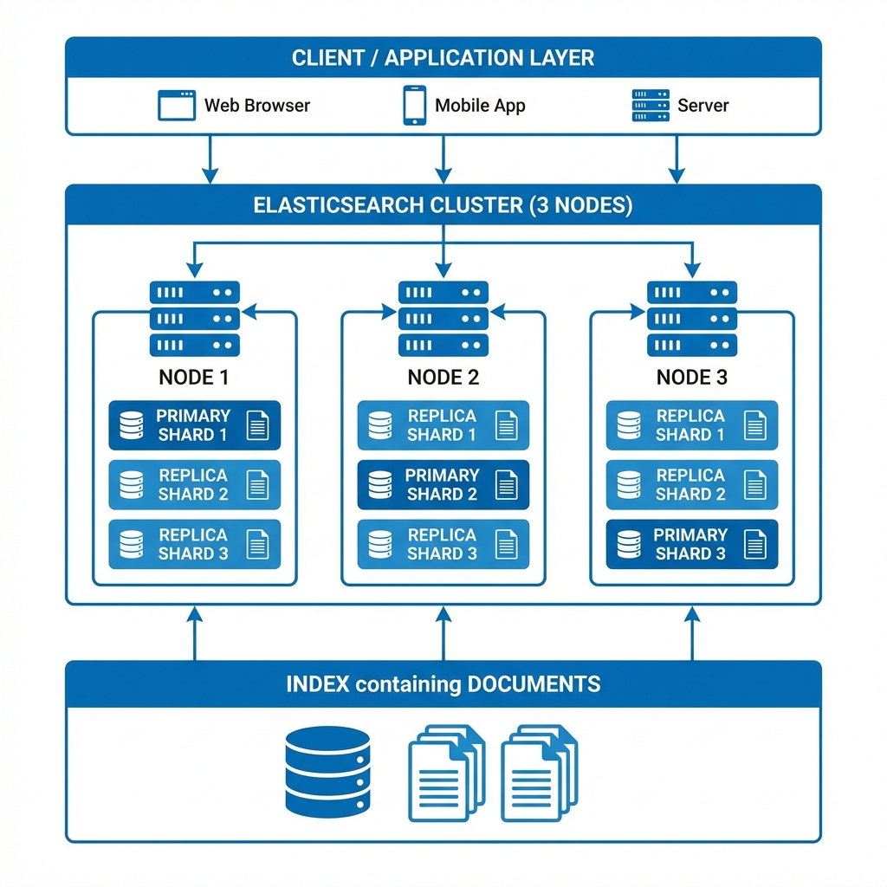
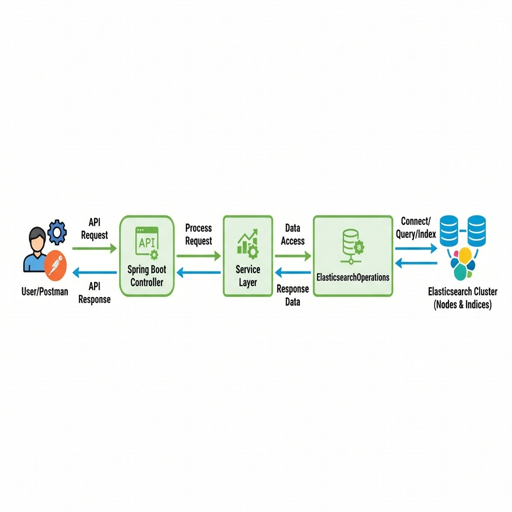
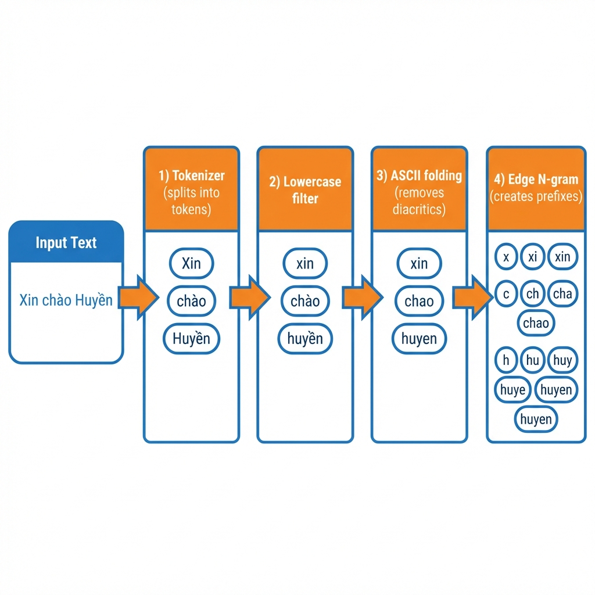

# 🔍 Spring Data Elasticsearch - Vietnamese Chat Search

> **Dự án demo:** Tìm kiếm tin nhắn chat tiếng Việt với Elasticsearch  
> **Tech Stack:** Spring Boot 3.x, Spring Data Elasticsearch, MongoDB, Docker

---

## 📖 Mục lục

1. [Giới thiệu](#1-giới-thiệu)
2. [Elasticsearch là gì?](#2-elasticsearch-là-gì)
3. [Index & Mapping - Cấu trúc dữ liệu](#3-index--mapping---cấu-trúc-dữ-liệu)
4. [Kibana là gì?](#4-kibana-là-gì)
5. [Kiến trúc hệ thống](#5-kiến-trúc-hệ-thống)
6. [Cài đặt môi trường](#6-cài-đặt-môi-trường)
7. [Cấu hình Spring Boot](#7-cấu-hình-spring-boot)
8. [Analyzer - Xử lý tiếng Việt](#8-analyzer---xử-lý-tiếng-việt)
9. [API Endpoints](#9-api-endpoints)
10. [Test với Postman](#10-test-với-postman)
11. [Troubleshooting](#11-troubleshooting)

---

## 1. Giới thiệu

### 🎯 Vấn đề cần giải quyết

Trong ứng dụng chat, người dùng thường gõ sai chính tả hoặc không có dấu:

| Người dùng gõ | Muốn tìm          |
| ------------- | ----------------- |
| `huyen`       | Huyền             |
| `Huỳen`       | Huyền             |
| `Huyennn`     | Huyền             |
| `huyeefn`     | Huyền (lỗi Telex) |

**MongoDB** không thể xử lý tốt các trường hợp này → Cần **Elasticsearch**!

### ✅ Giải pháp

```
┌─────────────┐     ┌─────────────┐     ┌─────────────────┐
│   MongoDB   │ ←── │  Spring     │ ──→ │  Elasticsearch  │
│  (Lưu trữ)  │     │    Boot     │     │   (Tìm kiếm)    │
└─────────────┘     └─────────────┘     └─────────────────┘
```

- **MongoDB**: Lưu trữ dữ liệu chính
- **Elasticsearch**: Index và tìm kiếm full-text
- **Spring Boot**: Sync dữ liệu giữa 2 database

---

## 2. Elasticsearch là gì?

### 📚 Định nghĩa

**Elasticsearch** là một search engine mã nguồn mở, được xây dựng trên **Apache Lucene**. Nó cho phép:

- ✅ Tìm kiếm full-text cực nhanh
- ✅ Tìm kiếm gần đúng (fuzzy search)
- ✅ Autocomplete
- ✅ Phân tích dữ liệu realtime
- ✅ Scale theo chiều ngang (horizontal scaling)

### 🏗️ Kiến trúc Elasticsearch



### 📦 Các khái niệm cơ bản

| Khái niệm    | Mô tả                     | Tương đương SQL |
| ------------ | ------------------------- | --------------- |
| **Cluster**  | Tập hợp các nodes         | Database Server |
| **Node**     | Một instance ES           | -               |
| **Index**    | Nơi lưu documents         | Database        |
| **Document** | Một record JSON           | Row             |
| **Field**    | Thuộc tính trong document | Column          |
| **Shard**    | Phần chia nhỏ của index   | Partition       |
| **Replica**  | Bản sao của shard         | Backup          |

### 🔄 So sánh Elasticsearch vs SQL

```
SQL:      SELECT * FROM users WHERE name LIKE '%huyen%'
          → Chậm, không tìm được "Huyền", "huỳen"

ES:       { "query": { "match": { "name": "huyen" } } }
          → Nhanh, tìm được tất cả biến thể
```

---

## 3. Index & Mapping - Cấu trúc dữ liệu

### 📚 Mapping là gì?

**Mapping** trong Elasticsearch giống như **schema** trong SQL. Nó định nghĩa:

- 📝 Các **field** trong document
- 🔤 **Kiểu dữ liệu** của mỗi field
- ⚙️ Cách **phân tích và index** text

### 🎯 Tại sao Mapping quan trọng?

```
❌ Không có mapping phù hợp:
   "Huyền" được index sai → Search không tìm thấy "huyen"

✅ Có mapping đúng:
   "Huyền" → analyzer → ["huyền", "huyen"] → Search tìm được!
```

### 📊 Các Field Types phổ biến

| Type           | Mô tả                        | Ví dụ                 | Search         |
| -------------- | ---------------------------- | --------------------- | -------------- |
| `text`         | Full-text, được phân tích    | content, description  | `match` query  |
| `keyword`      | Exact value, không phân tích | roomId, status, email | `term` query   |
| `long/integer` | Số nguyên                    | age, count            | `range` query  |
| `float/double` | Số thực                      | price, rating         | `range` query  |
| `boolean`      | True/False                   | isActive              | `term` query   |
| `date`         | Ngày tháng                   | createdAt             | `range` query  |
| `object`       | Nested object                | sender { id, name }   | Dot notation   |
| `nested`       | Array of objects             | comments[]            | `nested` query |

### 🔄 Dynamic Mapping vs Explicit Mapping

#### 🤖 Dynamic Mapping (Tự động)

Khi bạn index document **KHÔNG** định nghĩa mapping trước, Elasticsearch sẽ **tự đoán** kiểu dữ liệu:

```json
// Index document không có mapping
POST messages/_doc/1
{
  "content": "Xin chào",       // ES đoán: text
  "count": 10,                 // ES đoán: long
  "price": 99.99,              // ES đoán: float
  "isActive": true,            // ES đoán: boolean
  "createdAt": "2026-01-09"    // ES đoán: date
}
```

**Xem mapping được tạo tự động:**

```json
GET messages/_mapping
```

**Kết quả:**

```json
{
  "messages": {
    "mappings": {
      "properties": {
        "content": {
          "type": "text",
          "fields": {
            "keyword": { "type": "keyword", "ignore_above": 256 }
          }
        },
        "count": { "type": "long" },
        "price": { "type": "float" },
        "isActive": { "type": "boolean" },
        "createdAt": { "type": "date" }
      }
    }
  }
}
```

#### ⚠️ Vấn đề với Dynamic Mapping

| Vấn đề                | Mô tả                                              |
| --------------------- | -------------------------------------------------- |
| **Sai kiểu dữ liệu**  | `"123"` có thể bị đoán là `text` thay vì `keyword` |
| **Không có analyzer** | Text không được phân tích đúng cho tiếng Việt      |
| **Mapping Explosion** | Quá nhiều fields → tốn memory                      |
| **Khó thay đổi**      | Không thể đổi type sau khi đã có data              |

#### 📝 Explicit Mapping (Định nghĩa trước)

**Best practice:** Luôn định nghĩa mapping TRƯỚC khi index data!

```json
PUT messages
{
  "settings": {
    "number_of_shards": 1,
    "number_of_replicas": 1
  },
  "mappings": {
    "properties": {
      "id": {
        "type": "keyword"
      },
      "roomId": {
        "type": "keyword"
      },
      "content": {
        "type": "text",
        "analyzer": "vn_chat_analyzer",
        "search_analyzer": "vn_search_analyzer"
      },
      "createdAt": {
        "type": "date",
        "format": "yyyy-MM-dd'T'HH:mm:ss.SSS||yyyy-MM-dd||epoch_millis"
      },
      "sender": {
        "properties": {
          "id": { "type": "keyword" },
          "name": {
            "type": "text",
            "fields": {
              "keyword": { "type": "keyword" }
            }
          }
        }
      }
    }
  }
}
```

### 🎛️ Kiểm soát Dynamic Mapping

Bạn có thể điều chỉnh hành vi của dynamic mapping:

```json
PUT messages
{
  "mappings": {
    "dynamic": "strict",  // Không cho phép field mới
    "properties": {
      "content": { "type": "text" }
    }
  }
}
```

| Giá trị          | Hành vi                       |
| ---------------- | ----------------------------- |
| `true` (default) | Tự động thêm field mới        |
| `false`          | Ignore field mới, không index |
| `strict`         | Throw error nếu có field lạ   |
| `runtime`        | Tạo runtime field             |

### 📐 Dynamic Templates

Định nghĩa rule để tự động map fields theo pattern:

```json
PUT messages
{
  "mappings": {
    "dynamic_templates": [
      {
        "strings_as_keywords": {
          "match_mapping_type": "string",
          "match": "*_id",
          "mapping": {
            "type": "keyword"
          }
        }
      },
      {
        "strings_as_text": {
          "match_mapping_type": "string",
          "mapping": {
            "type": "text",
            "analyzer": "vn_chat_analyzer",
            "fields": {
              "keyword": { "type": "keyword" }
            }
          }
        }
      }
    ]
  }
}
```

**Giải thích:**

- Field có tên kết thúc bằng `_id` → `keyword`
- Các string khác → `text` với analyzer

### 🔀 Multi-fields

Một field có thể được index theo **nhiều cách khác nhau**:

```json
{
  "name": {
    "type": "text", // Cho full-text search
    "analyzer": "standard",
    "fields": {
      "keyword": {
        // Cho exact match, sorting
        "type": "keyword",
        "ignore_above": 256
      },
      "autocomplete": {
        // Cho autocomplete
        "type": "text",
        "analyzer": "autocomplete_analyzer"
      }
    }
  }
}
```

**Sử dụng:**

```json
// Full-text search
{ "match": { "name": "huyền" } }

// Exact match
{ "term": { "name.keyword": "Trần Huyền" } }

// Autocomplete
{ "match": { "name.autocomplete": "hu" } }
```

### 🔍 So sánh text vs keyword

```
┌─────────────────────────────────────────────────────────────┐
│                     FIELD TYPE: text                        │
├─────────────────────────────────────────────────────────────┤
│  Input: "Xin chào Huyền"                                    │
│           ↓ Analyzer                                        │
│  Tokens: ["xin", "chào", "huyền", "huyen"]                  │
│                                                             │
│  ✅ Match query: "huyền" → TÌM THẤY                         │
│  ✅ Match query: "xin" → TÌM THẤY                           │
│  ❌ Term query: "Xin chào Huyền" → KHÔNG (vì đã tokenize)   │
└─────────────────────────────────────────────────────────────┘

┌─────────────────────────────────────────────────────────────┐
│                   FIELD TYPE: keyword                       │
├─────────────────────────────────────────────────────────────┤
│  Input: "Xin chào Huyền"                                    │
│           ↓ Không Analyzer                                  │
│  Stored: "Xin chào Huyền" (nguyên văn)                      │
│                                                             │
│  ❌ Term query: "huyền" → KHÔNG (phải exact)                │
│  ✅ Term query: "Xin chào Huyền" → TÌM THẤY                 │
│  ✅ Dùng cho: sorting, aggregation, filtering               │
└─────────────────────────────────────────────────────────────┘
```

### 🧩 Spring Data Elasticsearch Mapping

Trong Java, dùng annotations để định nghĩa mapping:

```java
@Document(indexName = "message_index")
@Setting(settingPath = "static/elasticsearch/es-settings.json")
public class MessageDoc {

    @Id
    private String id;

    // Keyword - exact match, không phân tích
    @Field(type = FieldType.Keyword)
    private String roomId;

    // Text - full-text search với custom analyzer
    @Field(
        type = FieldType.Text,
        analyzer = "vn_chat_analyzer",
        searchAnalyzer = "vn_search_analyzer"
    )
    private String content;

    // Date với multiple formats
    @Field(
        type = FieldType.Date,
        pattern = "yyyy-MM-dd'T'HH:mm:ss.SSS||yyyy-MM-dd||epoch_millis",
        format = {}
    )
    private LocalDateTime createdAt;

    // Nested object
    @Field(type = FieldType.Object)
    private UserInfo sender;

    // Multi-field example
    @MultiField(
        mainField = @Field(type = FieldType.Text, analyzer = "standard"),
        otherFields = {
            @InnerField(suffix = "keyword", type = FieldType.Keyword),
            @InnerField(suffix = "autocomplete", type = FieldType.Text,
                        analyzer = "autocomplete_analyzer")
        }
    )
    private String name;
}
```

### ⚡ Tạo Index với Mapping trong Spring Boot

```java
@Component
@RequiredArgsConstructor
public class InitApp implements CommandLineRunner {

    private final ElasticsearchOperations elasticsearchOperations;

    @Override
    public void run(String... args) {
        var indexOps = elasticsearchOperations.indexOps(MessageDoc.class);

        // 1. Xóa index cũ nếu tồn tại
        if (indexOps.exists()) {
            indexOps.delete();
        }

        // 2. Tạo index mới với settings từ @Setting annotation
        indexOps.create();

        // 3. Apply mapping từ @Field annotations
        indexOps.putMapping();

        // 4. Giờ có thể index documents
    }
}
```

### 📋 Checklist Mapping

Trước khi deploy, hãy check:

- [ ] Đã định nghĩa explicit mapping
- [ ] Field cần search full-text → `text` với analyzer phù hợp
- [ ] Field cần filter/sort/aggregate → `keyword`
- [ ] Date field có format đúng
- [ ] Đã test analyzer với `_analyze` API
- [ ] Đã `putMapping()` sau khi `create()` index

---

## 4. Kibana là gì?

### 📊 Định nghĩa

**Kibana** là giao diện web để:

- 🔍 Query và visualize dữ liệu Elasticsearch
- 📈 Tạo dashboard, charts
- 🛠️ Quản lý index, mappings
- 🧪 Test queries với Dev Tools

### 🖥️ Giao diện Kibana Dev Tools

```
┌─────────────────────────────────────────────────────────┐
│  Kibana Dev Tools                                       │
├─────────────────────────────────────────────────────────┤
│  GET message_index/_search                              │
│  {                                                      │
│    "query": {                                           │
│      "match": { "content": "huyen" }                    │
│    }                                                    │
│  }                                                      │
│                                                         │
│  ▶ Run (Ctrl+Enter)                                     │
├─────────────────────────────────────────────────────────┤
│  Response:                                              │
│  {                                                      │
│    "hits": {                                            │
│      "total": { "value": 15 },                          │
│      "hits": [...]                                      │
│    }                                                    │
│  }                                                      │
└─────────────────────────────────────────────────────────┘
```

---

## 5. Kiến trúc hệ thống

### 🔄 Luồng dữ liệu



### 📁 Cấu trúc project

```
spring-data-elastic-search/
├── src/main/java/iuh/demo/elasticsearch/
│   ├── configuration/
│   │   └── InitApp.java           # Khởi tạo data
│   ├── controller/
│   │   └── ChatController.java    # REST API
│   ├── service/
│   │   └── ChatServiceImpl.java   # Business logic
│   ├── model/
│   │   ├── mongodb/
│   │   │   └── Message.java       # MongoDB entity
│   │   └── elasticsearch/
│   │       └── MessageDoc.java    # ES document
│   ├── repository/
│   │   └── mongo/
│   │       └── MessageRepository.java
│   ├── dto/
│   │   ├── request/
│   │   │   └── SearchRequest.java
│   │   └── response/
│   │       └── MessageSearchResult.java
│   └── util/
│       └── elasticsearch/
│           └── SearchUtil.java    # Query builder
├── src/main/resources/
│   ├── application.yml            # Config
│   └── static/elasticsearch/
│       └── es-settings.json       # ES analyzer config
└── docs/
    ├── README.md                  # File này
    ├── ELASTICSEARCH_CHEATSHEET.md
    └── elasticsearch-queries.kibana
```

---

## 6. Cài đặt môi trường

### 📋 Yêu cầu

- Java 17+
- Docker & Docker Compose
- Maven 3.8+

### 🐳 Docker Compose

Tạo file `docker-compose.yml`:

```yaml
version: "3.8"

services:
  # MongoDB
  mongodb:
    image: mongo:7.0
    container_name: mongodb
    ports:
      - "27017:27017"
    volumes:
      - mongodb_data:/data/db

  # Elasticsearch
  elasticsearch:
    image: docker.elastic.co/elasticsearch/elasticsearch:8.11.0
    container_name: elasticsearch
    environment:
      - discovery.type=single-node
      - xpack.security.enabled=false
      - "ES_JAVA_OPTS=-Xms512m -Xmx512m"
    ports:
      - "9200:9200"
    volumes:
      - es_data:/usr/share/elasticsearch/data

  # Kibana
  kibana:
    image: docker.elastic.co/kibana/kibana:8.11.0
    container_name: kibana
    environment:
      - ELASTICSEARCH_HOSTS=http://elasticsearch:9200
    ports:
      - "5601:5601"
    depends_on:
      - elasticsearch

volumes:
  mongodb_data:
  es_data:
```

### ▶️ Chạy Docker

```bash
# Khởi động tất cả services
docker-compose up -d

# Kiểm tra status
docker-compose ps

# Xem logs
docker-compose logs -f elasticsearch
```

### 🔗 URLs sau khi chạy

| Service       | URL                       |
| ------------- | ------------------------- |
| Elasticsearch | http://localhost:9200     |
| Kibana        | http://localhost:5601     |
| MongoDB       | mongodb://localhost:27017 |

---

## 7. Cấu hình Spring Boot

### 📦 Dependencies (pom.xml)

```xml
<dependencies>
    <!-- Spring Boot -->
    <dependency>
        <groupId>org.springframework.boot</groupId>
        <artifactId>spring-boot-starter-web</artifactId>
    </dependency>

    <!-- Spring Data MongoDB -->
    <dependency>
        <groupId>org.springframework.boot</groupId>
        <artifactId>spring-boot-starter-data-mongodb</artifactId>
    </dependency>

    <!-- Spring Data Elasticsearch -->
    <dependency>
        <groupId>org.springframework.boot</groupId>
        <artifactId>spring-boot-starter-data-elasticsearch</artifactId>
    </dependency>

    <!-- Lombok -->
    <dependency>
        <groupId>org.projectlombok</groupId>
        <artifactId>lombok</artifactId>
        <optional>true</optional>
    </dependency>
</dependencies>
```

### ⚙️ application.yml

```yaml
spring:
  application:
    name: spring-data-elastic-search

  # MongoDB
  data:
    mongodb:
      uri: mongodb://localhost:27017/chat_db

  # Elasticsearch
  elasticsearch:
    uris: http://localhost:9200
```

### 📄 MessageDoc.java (ES Document)

```java
@Document(indexName = "message_index")
@Setting(settingPath = "static/elasticsearch/es-settings.json")
public class MessageDoc {

    @Id
    private String id;

    @Field(type = FieldType.Keyword)
    private String roomId;

    @Field(type = FieldType.Object)
    private UserInfo sender;

    @Field(
        type = FieldType.Text,
        analyzer = "vn_chat_analyzer",        // Dùng khi index
        searchAnalyzer = "vn_search_analyzer" // Dùng khi search
    )
    private String content;

    @Field(
        type = FieldType.Date,
        pattern = "yyyy-MM-dd'T'HH:mm:ss.SSS||yyyy-MM-dd'T'HH:mm:ss||yyyy-MM-dd||epoch_millis"
    )
    private LocalDateTime createdAt;
}
```

### 🔧 es-settings.json (Analyzer Config)

```json
{
  "analysis": {
    "filter": {
      "vn_fold": {
        "type": "asciifolding",
        "preserve_original": true
      },
      "ngram_filter": {
        "type": "edge_ngram",
        "min_gram": 2,
        "max_gram": 20
      }
    },
    "analyzer": {
      "vn_chat_analyzer": {
        "type": "custom",
        "tokenizer": "standard",
        "filter": ["lowercase", "vn_fold", "ngram_filter"]
      },
      "vn_search_analyzer": {
        "type": "custom",
        "tokenizer": "standard",
        "filter": ["lowercase", "vn_fold"]
      }
    }
  }
}
```

---

## 8. Analyzer - Xử lý tiếng Việt

### 🤔 Vấn đề với tiếng Việt

Tiếng Việt có nhiều dấu và biến thể:

```
Huyền = Huyen = HUYỀN = huyen = Huỳen = Huyển
```

### 🔄 Giải pháp: Custom Analyzer



### 📝 Các Filter được sử dụng

| Filter              | Mô tả                   | Ví dụ                              |
| ------------------- | ----------------------- | ---------------------------------- |
| `lowercase`         | Chuyển thành chữ thường | `HUYỀN` → `huyền`                  |
| `asciifolding`      | Bỏ dấu tiếng Việt       | `huyền` → `huyen`                  |
| `preserve_original` | Giữ cả bản gốc          | `huyền` → `[huyền, huyen]`         |
| `edge_ngram`        | Tạo prefix tokens       | `huyen` → `[hu, huy, huye, huyen]` |

### 🧪 Test Analyzer trong Kibana

```json
GET message_index/_analyze
{
  "analyzer": "vn_chat_analyzer",
  "text": "Xin chào Huyền"
}
```

**Kết quả:**

```json
{
  "tokens": [
    { "token": "xi" },
    { "token": "xin" },
    { "token": "ch" },
    { "token": "cha" },
    { "token": "chao" },
    { "token": "hu" },
    { "token": "huy" },
    { "token": "huye" },
    { "token": "huyen" },
    { "token": "huyền" }
  ]
}
```

### ✅ Tại sao hoạt động?

```
SEARCH: "huyen"
        ↓ vn_search_analyzer
        ["huyen"]

INDEX:  "Huyền đẹp gái"
        ↓ vn_chat_analyzer
        [..., "hu", "huy", "huye", "huyen", "huyền", ...]

MATCH:  "huyen" có trong index tokens → ✅ TÌM THẤY!
```

---

## 9. API Endpoints

### 📤 POST /api/chat/search

**Request:**

```json
{
  "searchTerm": "huyen",
  "searchFields": ["content"],
  "termFilters": {
    "roomId": "1"
  },
  "rangeFilters": {
    "createdAt": {
      "from": "2026-01-01T00:00:00",
      "to": "2026-01-31T23:59:59"
    }
  },
  "page": 0,
  "size": 20
}
```

**Response:**

```json
{
  "content": [
    {
      "message": {
        "id": "abc123",
        "roomId": "1",
        "sender": {
          "id": "user1",
          "name": "Tran Thi B"
        },
        "content": "Huyền ơi, nay có đi làm không?",
        "createdAt": "2026-01-01T08:00:00.000"
      },
      "highlights": {
        "content": [
          "<span style='background-color:yellow'>Huyền</span> ơi, nay có đi làm không?"
        ]
      }
    }
  ],
  "totalElements": 15,
  "totalPages": 1,
  "size": 20,
  "number": 0
}
```

### 📤 POST /api/chat/send

**Request:**

```json
{
  "roomId": "1",
  "senderId": "user123",
  "content": "Xin chào mọi người!"
}
```

### 📥 GET /api/chat/history

**Parameters:**

- `roomId` (optional): Filter by room
- `page` (default: 0)
- `size` (default: 10)

---

## 10. Test với Postman

### 🔧 Collection Setup

1. Import collection hoặc tạo mới
2. Set base URL: `http://localhost:8080`

### 📝 Test Cases

#### Test 1: Search exact match

```json
POST /api/chat/search
{
    "searchTerm": "Huyền",
    "termFilters": { "roomId": "1" }
}
```

**Expected:** Tìm thấy messages chứa "Huyền"

#### Test 2: Search without diacritics

```json
POST /api/chat/search
{
    "searchTerm": "huyen",
    "termFilters": { "roomId": "1" }
}
```

**Expected:** Tìm thấy cả "Huyền", "Huyen", "Huỳen"...

#### Test 3: Search with typo

```json
POST /api/chat/search
{
    "searchTerm": "huyennn",
    "termFilters": { "roomId": "1" }
}
```

**Expected:** Tìm thấy do edge_ngram match

#### Test 4: Prefix search

```json
POST /api/chat/search
{
    "searchTerm": "hu",
    "termFilters": { "roomId": "1" }
}
```

**Expected:** Tìm thấy tất cả messages có từ bắt đầu bằng "hu"

---

## 11. Troubleshooting

### ❌ Lỗi: "Index not found"

**Nguyên nhân:** Index chưa được tạo

**Giải pháp:**

```java
// Trong InitApp.java
var indexOps = elasticsearchOperations.indexOps(MessageDoc.class);
if (indexOps.exists()) {
    indexOps.delete();
}
indexOps.create();
indexOps.putMapping();
```

### ❌ Lỗi: Search không tìm thấy kết quả mong muốn

**Nguyên nhân:** Index được tạo trước khi có settings

**Giải pháp:**

1. Xóa index cũ trong Kibana: `DELETE message_index`
2. Restart Spring Boot app
3. Data sẽ được index lại với analyzer mới

### ❌ Lỗi: Connection refused to Elasticsearch

**Nguyên nhân:** Docker container chưa chạy

**Giải pháp:**

```bash
docker-compose up -d
docker-compose ps  # Kiểm tra status
```

### ❌ Lỗi: Highlight không hiển thị

**Nguyên nhân:** Chưa cấu hình HighlightQuery

**Giải pháp:** Xem `SearchUtil.java` để cấu hình highlight

---

## 📚 Tài liệu tham khảo

- [Elasticsearch Official Docs](https://www.elastic.co/guide/en/elasticsearch/reference/current/index.html)
- [Spring Data Elasticsearch](https://docs.spring.io/spring-data/elasticsearch/docs/current/reference/html/)
- [Kibana Dev Tools Guide](https://www.elastic.co/guide/en/kibana/current/console-kibana.html)

---

## 👥 Đóng góp

Nếu có câu hỏi hoặc góp ý, vui lòng tạo Issue hoặc Pull Request!

---

> 📅 **Cập nhật lần cuối:** 2026-01-09  
> 👤 **Tác giả:** Trần Ngọc Huyền
